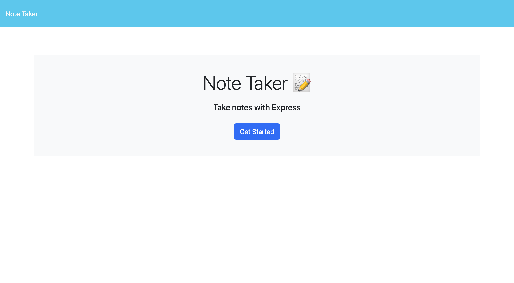
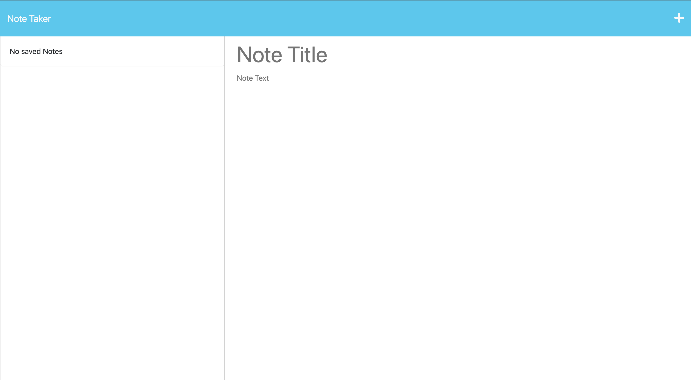
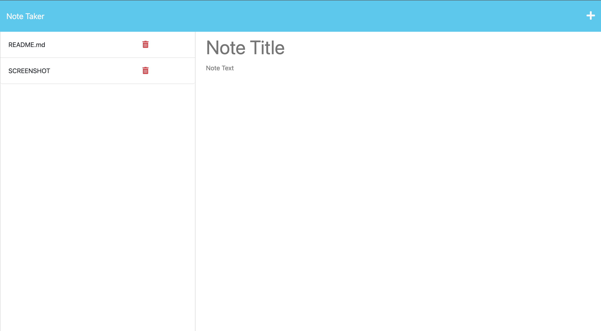
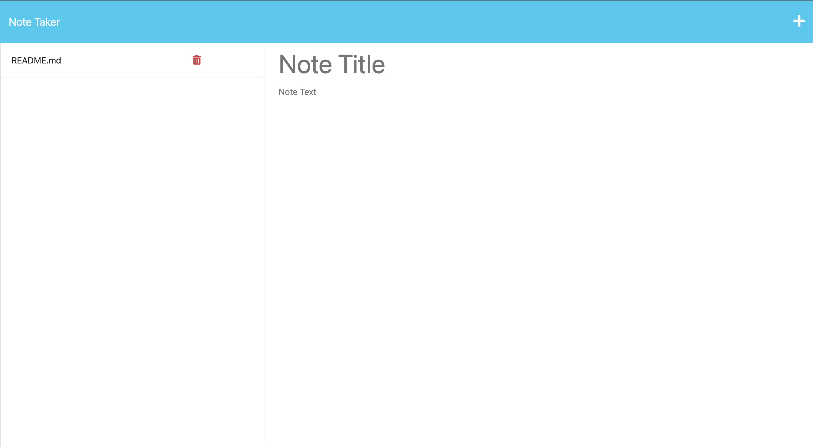

# NOTE TAKER

## Description

This application was built with provided front end code and need backend code to make it usable. The motivation was to allow the user to be able to make and delete notes for whatever they desired. I built this project because the app is vital to the users needs to write and save notes to be able to organize thoughts and keep on task ith day to day assignments and activities. It solves an issue of many people being disorganized or their organization methods being unreliable. I learned that while combining front-end and back-end creates a well made app with endless possibilities. 

## Installation

To install my application, I needed node.js to install a unique id dependency, as well as anything else in node to create a relationship between the front and back end products. Since the front end was given, after developing a working back-end and connection to the json file, I tested the application in my browser. Once that all seemed to work within the guidelines, I worked on deployed the application to Heroku. 

## Usage

Heroku Deployment Link: https://note-taker-carsonjames-d3b8724c2e89.herokuapp.com/

GitHub Repository: https://github.com/carsonjames1125/note-taker-carsonjames

## Credits

https://expressjs.com/en/starter/basic-routing.html
https://stackoverflow.com/questions/25471856/express-throws-error-as-body-parser-deprecated-undefined-extended
https://www.makeuseof.com/node-unique-ids-generate/
https://devcenter.heroku.com/articles/getting-started-with-nodejs#next-steps
https://www.simplilearn.com/tutorials/nodejs-tutorial/nodejs-functions

## License

MIT License

Copyright (c) [2023] [CarsonJames]

Permission is hereby granted, free of charge, to any person obtaining a copy
of this software and associated documentation files (the "Software"), to deal
in the Software without restriction, including without limitation the rights
to use, copy, modify, merge, publish, distribute, sublicense, and/or sell
copies of the Software, and to permit persons to whom the Software is
furnished to do so, subject to the following conditions:

The above copyright notice and this permission notice shall be included in all
copies or substantial portions of the Software.

THE SOFTWARE IS PROVIDED "AS IS", WITHOUT WARRANTY OF ANY KIND, EXPRESS OR
IMPLIED, INCLUDING BUT NOT LIMITED TO THE WARRANTIES OF MERCHANTABILITY,
FITNESS FOR A PARTICULAR PURPOSE AND NONINFRINGEMENT. IN NO EVENT SHALL THE
AUTHORS OR COPYRIGHT HOLDERS BE LIABLE FOR ANY CLAIM, DAMAGES OR OTHER
LIABILITY, WHETHER IN AN ACTION OF CONTRACT, TORT OR OTHERWISE, ARISING FROM,
OUT OF OR IN CONNECTION WITH THE SOFTWARE OR THE USE OR OTHER DEALINGS IN THE
SOFTWARE.

## Badges

n/a

## Features

n/a

## How to Contribute

n/a

## Tests

n/a
